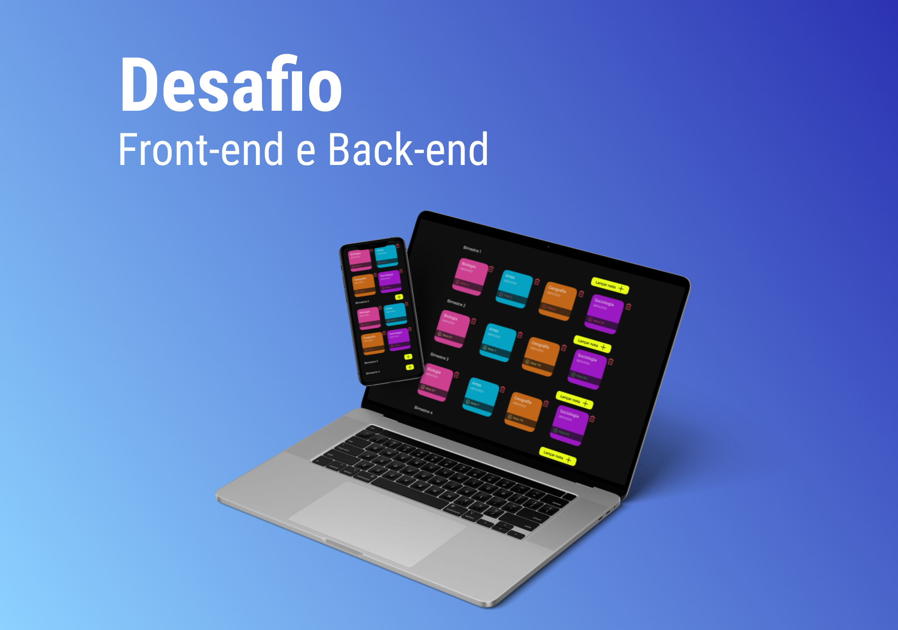

<h1 align="center">Desafio</h1>

<p align="center">Desenvolver um projeto para entrevista numa vaga de emprego aonde era necessário construir um Front-end e um Back-end.</p>



<p align="center">
  <a href="#-tecnologias">Tecnologias</a>&nbsp;&nbsp;&nbsp;|&nbsp;&nbsp;&nbsp;
  <a href="#memo-licença">Licença</a>
</p>

<p align="center">
  
</p>


## 🚀 Tecnologias

Esse projeto foi desenvolvido com as seguintes tecnologias:

### Front-End
- ViteJS com Typescript
- TailwindCSS
- Shadcn-UI
- React-hook-form
- Yup
- Axios
- Lucide-react

### Back-end
- NodeJS com Typescript
- Express
- Cors
- Prisma
- Yup
- Docker Compose

## 🚀 Etapas para rodar o projeto

Para iniciar o projeto, siga estas etapas:

> Clone o repositório do projeto:
```bash
git clone https://github.com/diovanealves/DesafioJR_MBPsicologia
```

> Acesse a pasta do projeto tanto a api quanto a web e execute o comando para instalar as dependências:
```bash
npm install
```

> Execute os comandos abaixo na pasta api:
```bash
docker-compose up
npm run dev 
```

> Execute o comando abaixo na pasta web:
```bash
npm run dev 
```

## Rotas da Aplicação

| Método   | Rota                            | Descrição                            |
|----------|---------------------------------|--------------------------------------|
| POST     | /disciplina                     | Criar uma nova nota                   |
| GET      | /disciplina                     | Busca todas as notas cadastradas      |
| GET      | /disciplina/:bimester/busca     | Busca as notas de um determinado bimestre |
| DELETE   | /disciplina/:id                 | Deleta uma nota                      |


<h2 align="center">Autor</h2>
<table>
  <tr>
    <td>
        
            <a href="https://github.com/diovanealves" style="color:#4f46e5" align="center">
                <p>Github</p>
            </a>
            <a href="https://www.linkedin.com/in/diovane-alves-de-oliveira-5320a0217/" style="color:#4f46e5" align="center">
                <p>Linkedin</p>
            </a>
            <a href="https://twitter.com/deluxyfps" style="color:#4f46e5" align="center">
                <p>Twitter</p>
            </a>
    </td>
  </tr>
</table>

## 📝 Licença

Esse projeto está sob a licença MIT.
